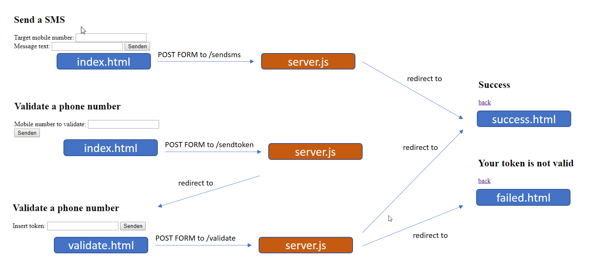

# cf-sample-app-smartmsg
A sample app which demonstrates how to use the Smart Messaging service on the Swisscom Application Cloud

## Installation.
Open the Swisscom AppCloud Developer Console: https://developer.swisscom.com

### Create SmartMessaging Service
1. select "create Service"
2. select "Smart Messaging" and assign a suitable name.
3. Use the "Manage" button to validate your sender number first.
4. The service is now then ready use.

### Create SmartMessagingDemo App
1. Download the SmartMessagingDemo ZIP here: https://github.com/swisscom/cf-sample-app-smartmsg/releases/download/1/SmartMessagingDemoV1.zip
2. create a new Node. JS App with the button "push App".
* Choose a name, e. g."sms-demo"
* Choose the downloaded ZIP
* Connect the SmartMessaging service you created previously
3. The demo is now available under https://sms-demo.scapp.io (depending on you app name)

